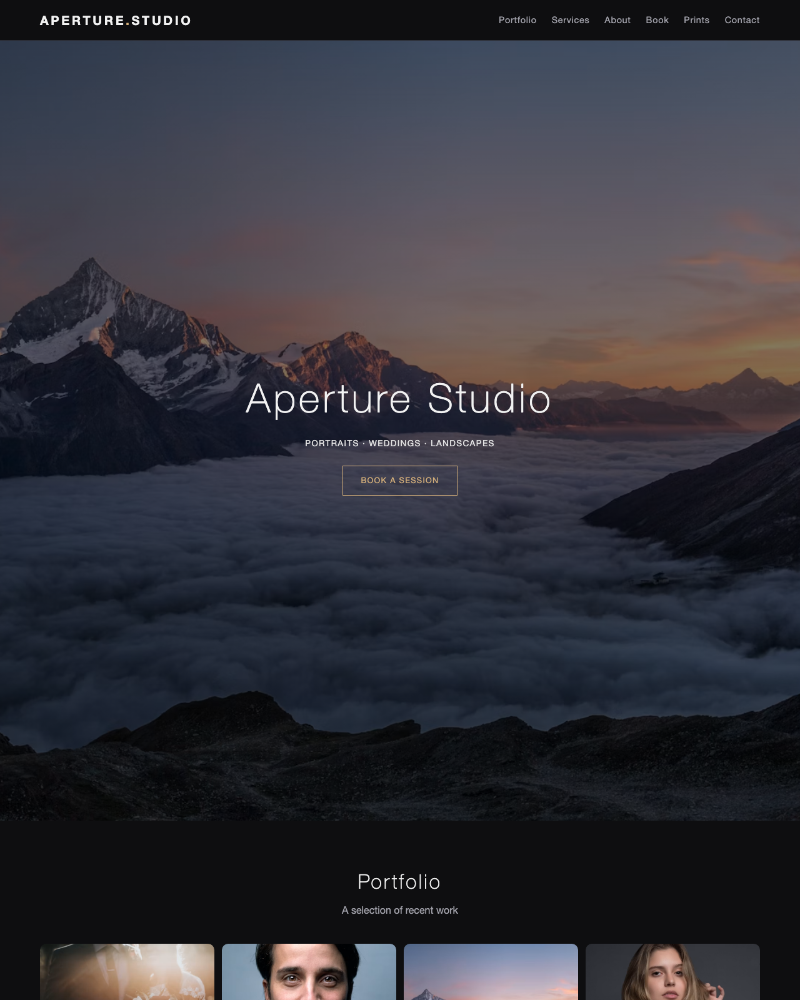

# Photography Starter

[](LICENSE)


A ready-to-use, single-page **photography website** — portfolio galleries,
services/pricing, an about section, a bookings area, a print store, and a contact
form. Pure HTML/CSS/JS: **no build step, no dependencies**. Open it and it works;
deploy it free on GitHub Pages.

> This is the working companion to
> [photography-website-guide](https://github.com/varun-doode/photography-website-guide).



## Preview it locally

No install needed — either open `index.html` in a browser, or serve the folder:

```bash
# Python (built in on macOS/Linux)
python3 -m http.server 8000
# then open http://localhost:8000
```

## What's included

| Section | Notes |
|---------|-------|
| **Hero** | Full-screen image + call-to-action |
| **Portfolio** | Responsive gallery with click-to-zoom lightbox |
| **Services** | Pricing cards |
| **About** | Photo + bio |
| **Book** | Placeholder for a Calendly / Cal.com embed |
| **Prints** | Placeholder store cards for Stripe / print-on-demand |
| **Contact** | Formspree-ready contact form |
| Mobile nav, sticky header, dark theme | All responsive |

## Make it yours

1. **Photos** — replace the Unsplash URLs in `index.html` with your own images.
   Put files in `img/` and reference them (e.g. `img/wedding-01.jpg`). Compress
   first (see the guide) — aim for under ~400 KB each.
2. **Text** — edit the brand name, bio, and service prices in `index.html`.
3. **Bookings** — in the `#book` section, paste your Calendly inline embed:
   ```html
   <div class="calendly-inline-widget" data-url="https://calendly.com/your-name/session"
        style="min-width:320px;height:700px;"></div>
   <script src="https://assets.calendly.com/assets/external/widget.js" async></script>
   ```
4. **Store** — replace the `Buy print` links with
   [Stripe Payment Links](https://stripe.com/payments/payment-links) or a
   print-on-demand store URL.
5. **Contact form** — create a form at [Formspree](https://formspree.io) and
   replace `YOUR_FORM_ID` in the form's `action`.
6. **Colors/fonts** — tweak the design tokens at the top of `css/style.css`.

## Deploy free on GitHub Pages

1. Push this repo to GitHub.
2. **Settings → Pages → Source: Deploy from a branch → main / (root)**.
3. Live in ~1 minute at `https://<username>.github.io/photography-starter/`.

A ready-made GitHub Actions workflow is included at
`.github/workflows/pages.yml` if you prefer Actions-based deploys.

For a custom domain (e.g. `yourname.photography`) and SEO/analytics tips, see the
[full guide](https://github.com/varun-doode/photography-website-guide).

## License

MIT — free to use and adapt.
